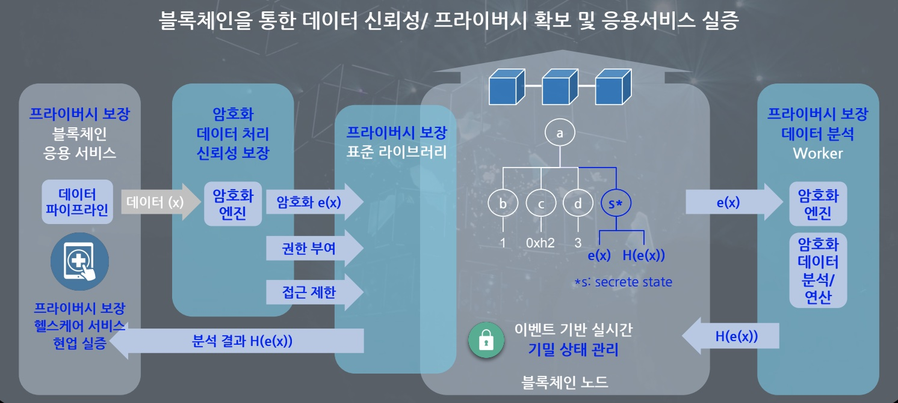

# 통합 분석 환경 플랫폼 상세 설계
## 실증구성도

## 프라이버시 보장 헬스케어 서비스
* 서비스에 필요한 데이터를 암호화된 형태로 제공하며, 필요 시 소유자가 데이터를 복호화하여 확인 할 수 있는 서비스
## 동형암호 및 블록체인 키 관리 엔진
* 브라우저 익스텐션 형태의 어플리케이션을 활용하여 동형암호와 블록체인에 사용되는 키들을 관리하는 부분
## 이벤트 기반 실시간 블록체인 노드
* 암호화된 데이터 관리 및 접근 제어를 수행하며, 필요에 따라 이벤트 기반으로 동형암호 연산 작업을 워커에게 할당하는 역할
## 프라이버시 보장 데이터 분석 워커
* 암호화된 데이터를 기반으로 할당받은 작업을 수행하여 필요한 암호화된 결과를 다시 블록체인에 제공하는 역할
